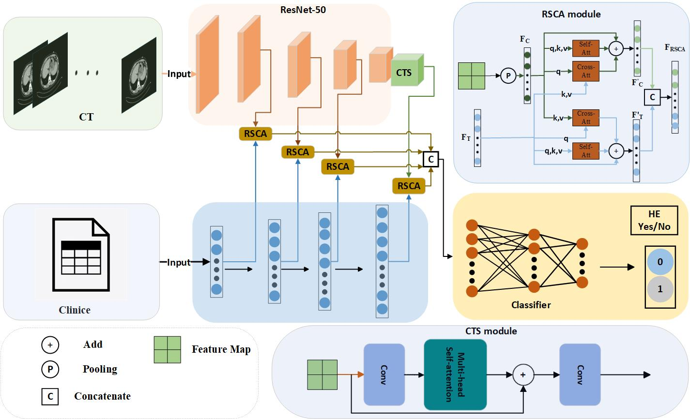

# MAMF-Net:Multi-Modal And Multi-Scale Feature Fusion in Predicting Hepatic Encephalopathy

This repository is an official implementation of the paper Multi-Modal And Multi-Scale Feature Fusion in Predicting Hepatic Encephalopathy


## Introduction

The proposed prediction model MAMF-Net integrates three components: a multimodal feature extractor, a rich attention fusion, and a classifier. Firstly, since clinical data and CT data are of different modalities, the multimodal feature extractor will process the input of different types of data and use the CTS module to extract the global information of the high-level stage image features. Multi-level features are extracted and fused by RSCA module. The features obtained by the fusion of each layer are concatenated and input into the classifier for classification.




## Installation

run command line as following

```
pip install -r requirements.txt
```


## Train

```
nohup python -u train.py  --batch_size 8 --image_lr 0.0001 --image_eta_min 0 --image_T_max 20 --project_name "XXX"  --device "cuda:XXX" --run_name "XXX" >XXX.log 2>&1 &
```

## Test

During the training phase, the model is tested for each training round.
